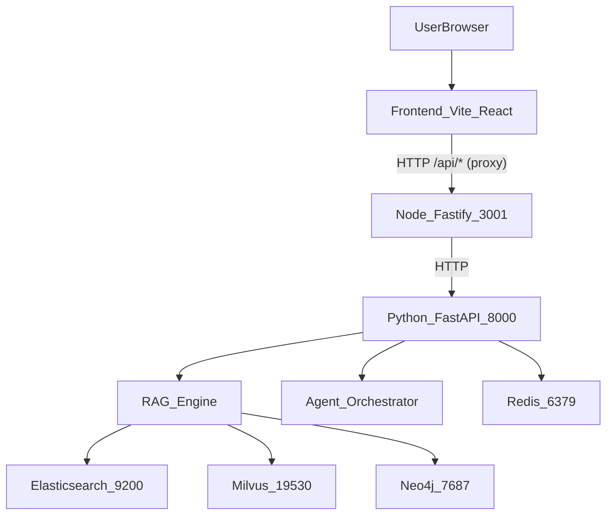
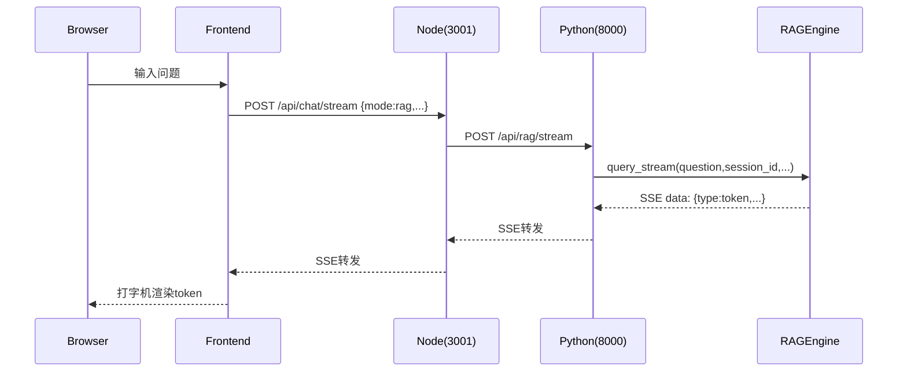
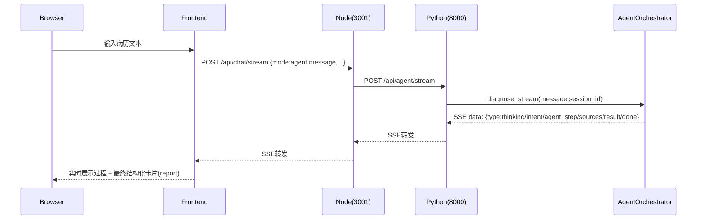
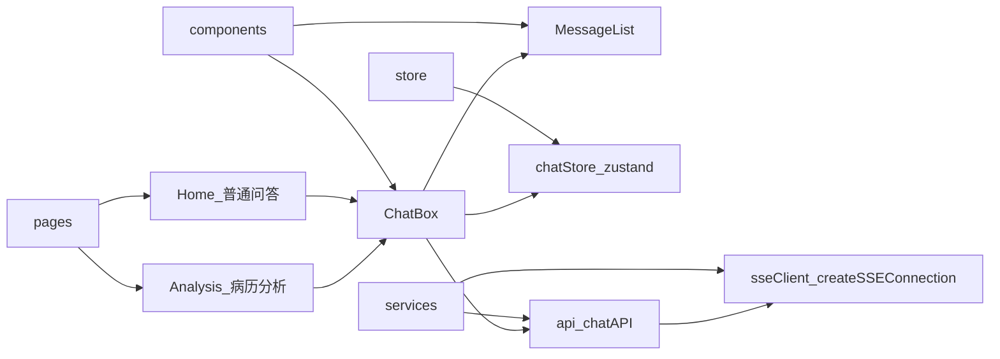
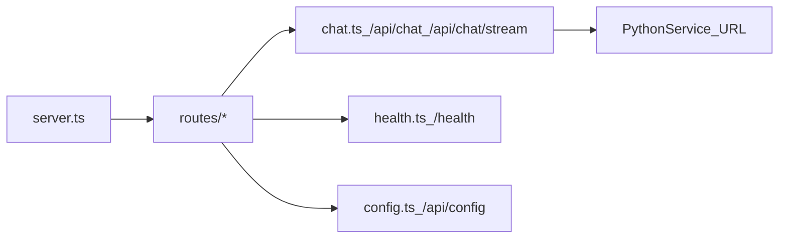
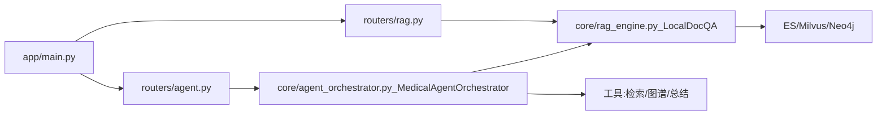

# 医疗 AI 辅助诊断系统

一个包含 **RAG 医疗问答** 与 **多智能体病历分析** 的端到端演示系统，采用三层架构：

- **Frontend**：React + Ant Design（Vite）
- **API 网关**：Node.js（Fastify）
- **AI 服务**：Python（FastAPI），内含 RAG 引擎与 Agent 编排器

> 本仓库中还有一个历史子项目 `RAGQnASystem/`，本文档聚焦 `medical-ai-demo/` 这一套可运行的前后端联调 Demo。

## 快速开始（本机开发）

### 端口约定

- **Frontend**：`http://localhost:3002`（Vite dev server，见 `frontend/vite.config.ts`）
- **Node Backend**：`http://localhost:3001`
  - 健康检查：`GET /health`
  - 前端通过 Vite proxy 将 `/api/`* 转发到 Node
- **Python Service**：`http://localhost:8000`
  - 健康检查：`GET /health`

### 环境要求

- Node.js（建议 18+）
- pnpm
- Python（建议 3.10/3.11；与深度学习依赖兼容更好）
-（可选）Docker / Docker Compose：用于一键拉起 Milvus/ES/Neo4j/Redis 等依赖

### 方式 A：用 Docker Compose 拉起全部依赖（推荐）

1. 进入目录并准备环境变量：

```bash
cd medical-ai-demo
cp .env.example .env
```

1. 编辑 `.env`，至少填好：

- `DASHSCOPE_API_KEY`（默认 LLM 配置使用 DashScope 的 OpenAI 兼容接口）
- `NEO4J_PASSWORD`（供 compose 内的 neo4j 使用）

1. 启动依赖与服务：

```bash
docker compose up -d
```

1. 打开前端：

- `http://localhost:3000`（注意：compose 中前端映射是 `3000:3000`，与本机 `pnpm dev` 的 `3002` 不同）

> 说明：`docker-compose.yml` 中前端容器端口为 3000；本机 `pnpm dev` 时是 3002。

### 方式 B：本机分别启动（更适合开发调试）

#### 1) 启动 Python Service（8000）

```bash
cd medical-ai-demo/python-service
python -m venv .venv
source .venv/bin/activate
pip install -r requirements.txt
uvicorn app.main:app --reload --port 8000
```

#### 2) 启动 Node Backend（3001）

```bash
cd medical-ai-demo/node-backend
pnpm install
pnpm dev
```

Node 默认会把请求转发到 `PYTHON_SERVICE_URL`（默认 `http://localhost:8000`，见 `node-backend/src/config.ts`）。

#### 3) 启动 Frontend（3002）

```bash
cd medical-ai-demo/frontend
pnpm install
pnpm dev
```

打开：`http://localhost:3002`。

## 使用说明

系统 UI 顶部有两个 Tab（路由页）：

- **普通问答**（RAG）
- **病历分析**（Agent，多智能体协作）

### 普通问答（RAG）

- **输入**：医疗相关问题（自然语言）
- **输出**：回答 +（可选）参考文献 sources
- **流式输出**：前端支持 SSE 流式显示（“流式输出”开关）
- **图谱检索**：前端可切换“图谱检索”开关（后端会将 `useGraph` 传给 Python RAG）

### 病历分析（Agent）

- **输入**：病历文本/症状描述（文字）
- **输出**：结构化病历分析报告（`report`，严格 JSON）+ 简短总结（`answer`/`report.summary`）+（可选）推理过程（`trace`）
- **流式输出**：支持 SSE 流式（`thinking / intent / agent_step / sources / result / done`），前端会实时更新“思考过程”，并在 `result` 到达后渲染结构化卡片。

#### 病历分析输出 JSON（`report: AgentReport`）

`report` 的核心字段如下（前端按模块卡片渲染）：

- `validated_record`: 规范化与纠错（`normalized_text / missing_fields / contradictions / corrections`）
- `intent`: 意图与问题消解（`raw_question / resolved_question / intent_type / confidence`）
- `structured_case`: 病历结构化抽取（`chief_complaint / symptoms / duration / vitals / history / medications / allergies / tests`）
- `symptom_analysis`: 病症分析（`key_findings / possible_conditions`）
- `triage`: 紧急程度（`severity_level: emergency|urgent|routine / red_flags / why`）
- `department`: 科室推荐（`recommended / alternatives / reason`）
- `next_steps`: 下一步举措（`immediate_actions / recommended_tests / when_to_seek_care`）
- `treatment_safety`: 安全审阅（`medication_considerations / contraindications / cautions`）
- `summary`: 1–3 句总结（含免责声明）
- `trace`: 多 agent 过程记录（用于前端折叠面板展示/调试）

## 总体架构




## 关键流程图

### 1) RAG：SSE 流式问答

对应代码：

- 前端：`frontend/src/services/api.ts` → `POST /api/chat/stream`
- Node：`node-backend/src/routes/chat.ts` → 转发到 Python `POST /api/rag/stream`
- Python：`python-service/app/routers/rag.py` → `rag_engine.query_stream(...)`




### 2) Agent：SSE 流式病历分析（多 Agent）

对应代码：

- Node：`node-backend/src/routes/chat.ts` 中 `mode === 'agent'` → Python `POST /api/agent`
- Python：`python-service/app/routers/agent.py` 汇总 `diagnose_stream`，返回 `answer + trace`




## 各模块功能图

### Frontend（`medical-ai-demo/frontend`）




### Node Backend（`medical-ai-demo/node-backend`）




### Python Service（`medical-ai-demo/python-service`）




## 常见问题（FAQ）

### 1) 日志提示 Milvus 连接失败，但仍能回答？

RAG 可能会降级走 **Elasticsearch** 或其它检索来源；是否可用取决于你本机/容器中哪些依赖服务已启动。

### 2) 本机 dev 端口与 docker compose 端口不一致

- 本机前端：Vite `3002`（`frontend/vite.config.ts`）
- compose 前端：映射 `3000:3000`（`docker-compose.yml`）

如果你更偏向开发调试，建议使用“方式 B”分别启动；如果只想一键跑通，用“方式 A”即可。

## 开发者调试

- Node 健康检查：`GET http://localhost:3001/health`
- Python 健康检查：`GET http://localhost:8000/health`
- Node 配置回显：`GET http://localhost:3001/api/config`

### 配置与环境变量

- **Node → Python 转发**：`PYTHON_SERVICE_URL`（默认 `http://localhost:8000`）
- **LLM（OpenAI 兼容接口）**：Python 侧通过以下环境变量连接（见 `python-service/app/config.py`）：
  - `DASHSCOPE_API_KEY`: OpenAI 兼容接口的 `api_key`
  - `LLM_API_BASE`: OpenAI 兼容接口的 `base_url`（如 DashScope 兼容地址、OneAPI 地址、本地 vLLM/ollama 的兼容地址）
  - `LLM_MODEL`: 模型名（默认 `qwen-turbo`）
- **依赖服务（Python 侧）**：Milvus / Elasticsearch / Neo4j / Redis 的地址通常通过环境变量读取；参考：
  - `medical-ai-demo/.env.example`
  - `medical-ai-demo/docker-compose.yml`

## 变更记录（最近一次）

- **Agent 流式链路对齐**：Node 的 `POST /api/chat/stream` 在 `mode=agent` 时已转发到 Python `POST /api/agent/stream`（SSE）。
- **病历分析严格 JSON**：Python 输出 `report: AgentReport`（含意图、病历校验纠错、结构化抽取、紧急程度、科室、下一步举措、安全审阅等模块）。
- **前端卡片展示**：病历分析结果会以卡片展示（紧急程度/科室/下一步举措），并保留过程日志与 sources。

涉及文件（节选）：

- `node-backend/src/routes/chat.ts`
- `python-service/app/core/agent_orchestrator.py`
- `python-service/app/models/request.py`
- `python-service/app/models/response.py`
- `python-service/app/routers/agent.py`
- `frontend/src/services/api.ts`
- `frontend/src/components/ChatBox.tsx`
- `frontend/src/components/MessageList.tsx`
- `frontend/src/types/shared.ts`

