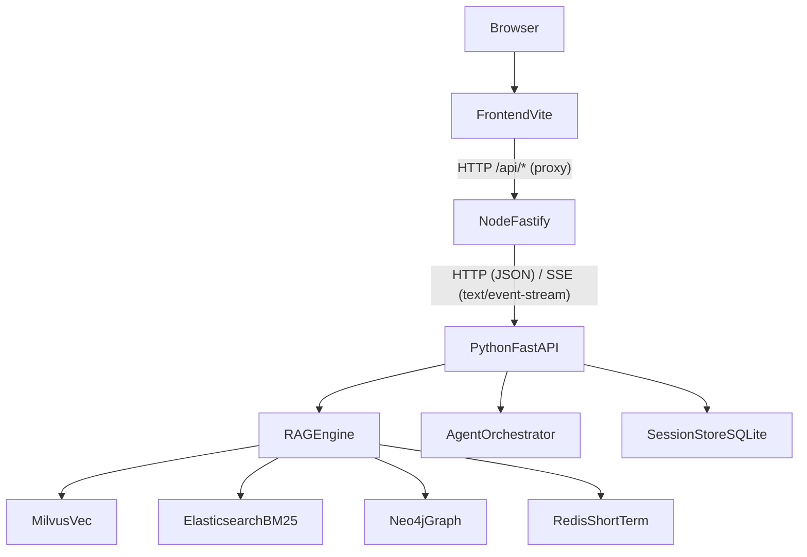
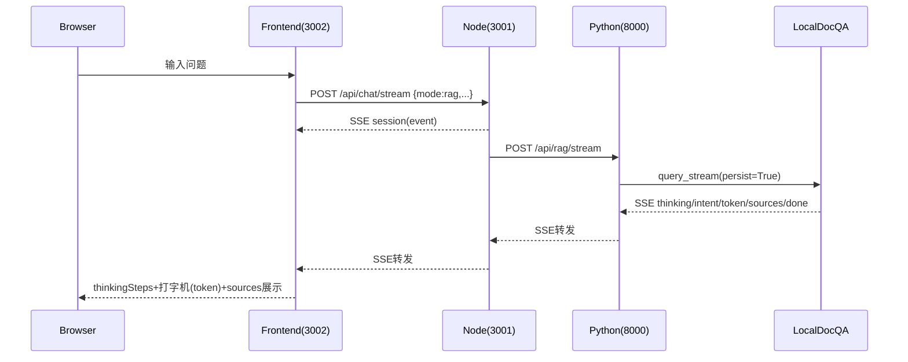
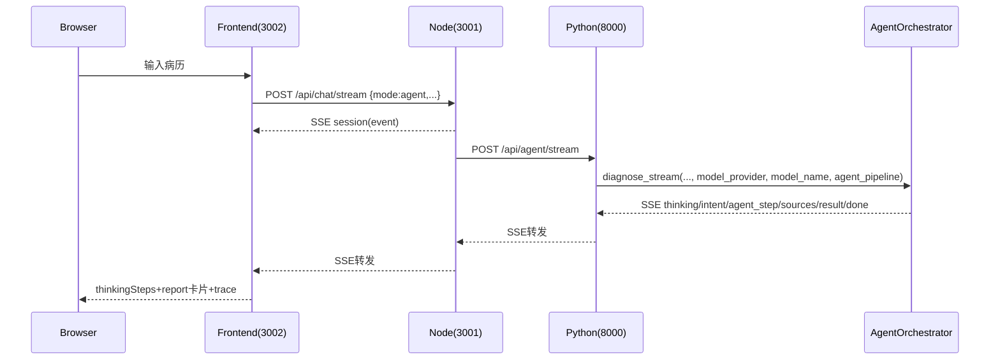
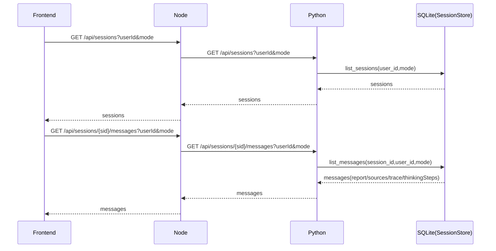

# medical-ai 设计文档（研发版）

> 目标：作为后续迭代的“单一事实来源（SSOT）”。在改任何功能前，先通过本文档定位**接口契约**、**数据流**、**持久化边界**与**依赖关系**，降低“改 A 炸 B”的概率。

## 项目概览

- **功能**：
  - **RAG 医疗问答**（支持 SSE 流式）
  - **Agent 病历分析**（多阶段编排 + SSE 事件流 + 最终结构化 `report`）
  - **会话系统**：RAG/Agent 两套会话列表、重命名/归档、SQLite 持久化、历史恢复
  - **思考过程持久化**：SSE `thinking` 步骤落库，刷新后仍可展开查看
- **三层架构**：
  - Frontend（React + Ant Design + Vite）
  - Node Backend（Fastify API 网关）
  - Python Service（FastAPI：RAG/Agent/Sessions）

## 术语表

- **Session**：一次对话上下文（按 `mode` 区分：`rag`/`agent`）。
- **Message**：会话中的一条消息（`role=user|assistant`）。
- **SSE Event**：流式输出的事件单元，形如 `{"type": "...", "content": ...}`，用 `data: <json>\n\n` 传输。
- **Sources**：检索到的参考资料摘要（用于溯源展示与回答约束）。
- **AgentReport**：病历分析最终结构化 JSON（前端卡片渲染依据）。
- **ThinkingSteps**：RAG/Agent 流式链路产生的 `thinking` 文本列表（持久化后可回放）。

## 总体架构

## 端口与运行模式

- **本机开发**：
  - Frontend（Vite dev）：`http://localhost:3002`（`frontend/vite.config.ts`）
  - Node Backend：`http://localhost:3001`
  - Python Service：`http://localhost:8000`
- **Docker Compose**：
  - Frontend：`http://localhost:3000`（容器映射）
  - Node Backend：`http://localhost:3001`
  - Python Service：`http://localhost:8000`

## 数据模型（契约）

### Frontend（TypeScript）

来源：`frontend/src/types/shared.ts`

- `ChatMode = 'rag' | 'agent'`
- `Message`：`{ id, role, content, sources?, trace?, report?, thinkingSteps?, thinkingExpanded? }`
- `AgentReport`：包含 `triage/department/next_steps/...` 与 `trace`

### Python（Pydantic）

来源：`python-service/app/models/request.py`、`python-service/app/models/response.py`

- `ChatRequest`：
  - `session_id?: str`
  - `user_id?: str`
  - `message: str`
  - `use_graph?: bool`
  - `chat_history?: List[{role, content, ...}]`
  - `model_provider?: 'qwen'|'deepseek'`（**病历分析 Agent**：未传或非法值时由服务端默认 `AGENT_DEFAULT_LLM_PROVIDER`，默认 **`deepseek`**；**RAG** 仍按请求与既有逻辑选择提供方）
  - `model_name?: str`（DeepSeek 下多 Agent 默认各角色 **`deepseek-chat`**；可被 `AGENT_MODEL_*` 环境变量按角色覆盖）
  - `agent_pipeline?: 'fast'|'full'`
- `ChatResponse`：
  - `answer: str`
  - `sources?: List[Source]`
  - `trace?: List[TraceItem]`
  - `report?: AgentReport`

## API 设计（最重要的契约）

### Node Backend（对前端暴露，统一 `/api` 前缀）

来源：`node-backend/src/routes/*.ts`

- **聊天**：
  - `POST /api/chat`（非流式；multipart 或 JSON）
  - `POST /api/chat/stream`（SSE 流式）
- **会话**：
  - `POST /api/sessions`
  - `GET /api/sessions?userId=...&mode=rag|agent&includeArchived=...`
  - `GET /api/sessions/:sessionId/messages?userId=...&mode=rag|agent&limit=...`
  - `POST /api/sessions/:sessionId/rename`
  - `POST /api/sessions/:sessionId/archive`
- **配置回显**：
  - `GET /api/config`
- **健康检查**（无 `/api` 前缀）：
  - `GET /health`

### Python Service（内部服务接口，统一 `/api` 前缀）

来源：`python-service/app/routers/*.py`

- **RAG**
  - `POST /api/rag`：非流式 `{answer, sources}`（当带 `user_id` 时也会落库）
  - `POST /api/rag/stream`：SSE 事件流
- **Agent**
  - `POST /api/agent`：非流式 `ChatResponse`（内部消费 `diagnose_stream`；当带 `user_id` 时会落库）
  - `POST /api/agent/stream`：SSE 事件流
- **Sessions**
  - `POST /api/sessions`
  - `GET /api/sessions`
  - `GET /api/sessions/{session_id}/messages`（返回 `thinkingSteps`）
  - `POST /api/sessions/{session_id}/rename`
  - `POST /api/sessions/{session_id}/archive`

## SSE 事件协议

> **协议版本**：`sse_protocol_version = 1`（兼容旧实现：仍以 `type/content` 为核心；新增字段前端必须忽略未知字段）。
>
> **事件统一结构（Envelope）**：通过 `data: <json>\n\n` 发送，最小字段如下：
>
> - `type: string`：事件类型（例如 `token/thinking/sources/result/done/error/session`）
> - `content: any`：事件负载
>
> v1 额外推荐字段（用于 Phase 0 的“关联字段贯通/取消/反馈闭环”）：
>
> - `request_id?: string`：一次 HTTP 请求的关联 ID（Node 生成，贯通 Node→Python→SSE→LangSmith）
> - `run_id?: string`：一次生成/流式运行的关联 ID（Node 生成；后续 cancel/feedback 的主键）
> - `seq?: number`：事件序号（同一条 SSE 流内单调递增，便于调试与断线续传对齐）

### request_id / run_id 生成与传递（SSOT）

> 目标：同一次请求可在 **Node 日志**、**Python 日志**、**LangSmith trace** 中通过同一组 ID 串起来；并且 SSE 事件都可携带该组 ID。

- **生成位置**：Node（`node-backend/src/routes/chat.ts`）
  - 若浏览器未提供，则 Node 生成 `request_id/run_id`（UUID）
- **Node → Python 透传方式**（HTTP headers）
  - `X-Request-ID: <request_id>`
  - `X-Run-Id: <run_id>`
- **Python 侧回传方式**
  - Python SSE 事件在每个事件中附带：`request_id/run_id/seq`（由 `python-service/app/core/sse_envelope.py` 统一注入）
- **浏览器可见性（调试）**
  - Node 会在响应头中回传 `X-Request-ID/X-Run-Id`（便于在 DevTools 的 Response Headers 中查看）

### RAG SSE（`POST /api/rag/stream`）

来源：`python-service/app/core/rag_engine.py`

- `thinking: string`：过程输出（会被持久化为 `thinkingSteps`）
- `intent: object`：意图识别与改写等调试信息（可选）
- `token: string`：流式 token
- `sources: Source[]`：来源（最多 5 条摘要）
- `done: ""`：结束
- `error: string`：异常（由路由或网关包装）

### Agent SSE（`POST /api/agent/stream`）

来源：`python-service/app/core/agent_orchestrator.py`

- `thinking: string`：阶段进度（会被持久化为 `thinkingSteps`）
- `intent: object`：意图结果
- `agent_step: {agent, step, detail}`：阶段产出
- `sources: Source[]`：可选参考资料
- `result: AgentReport`：最终结构化报告
- `error: string`
- `done: ""`

### Node 注入事件

来源：`node-backend/src/routes/chat.ts`

- `session: string`：在转发 python SSE 之前先发出 `sessionId`，用于前端绑定会话。

## 关键流程（时序图）

### 1) RAG：SSE 流式问答

### 2) Agent：SSE 流式病历分析

### 3) Sessions：历史恢复

## RAG 设计细节

### 检索与编排（Python）

来源：`python-service/app/core/rag_engine.py`、`intent_router.py`

典型链路：

1. **历史恢复/持久化**：
   - 优先从 **SQLite SessionStore** 恢复历史（未显式传 `chat_history` 时）
   - Redis `ShortTermMemory` 可作为兜底/缓存（可失败）
2. **指代消解**：`ContextResolver.resolve_query`（仅在疑似追问时触发）
3. **意图识别**：`HybridIntentClassifier.classify`
4. **问题改写**：`RewriteQuestionChain.rewrite`（仅对需要检索的意图）
5. **路由检索**：
   - graph_enhanced：Neo4j 证据 +（Milvus/ES）补充
   - hybrid_retrieve：Milvus（向量/MMR）+ ES（BM25）混合
6. **重排序**：CrossEncoder reranker（容错降级）
7. **上下文构建**：`ContextBuilder.build_retrieval_context`（token 预算）
8. **LLM 生成**：OpenAI-compatible streaming

### 上下文工程（RAG）

来源：`python-service/app/core/context_builder.py`、`llm_client.py`

- **消息编排**：`system_rules` → `history_window` → `retrieval_context(紧贴问题前)` → `user`
- **历史窗口**：按 token 预算截断（`MAX_HISTORY_TOKENS`）；对“最初/一开始”等问题会**钉住首条用户消息**。
- **反幻觉约束**：
  - 明确“不得捏造用户画像”
  - 参考资料中出现的病例信息**不得当作用户事实**，只能作为通用知识总结

## Agent 设计细节

来源：`python-service/app/core/agent_orchestrator.py`

- **阶段式编排**：intent → validate → extract → retrieve_evidence → analyze → triage → dept → plan → safety → coordinator
- **产物**：
  - `agent_step`：每阶段 `detail`（前端用于过程展示）
  - `result`：最终 `AgentReport`（前端卡片渲染）
- **最小上下文工程**：
  - 从 SQLite 恢复最近少量 agent 历史，形成 `history_brief`，用于减少重复询问/漂移

### LLM 提供方与模型（Agent）

- **默认提供方**：`diagnose_stream` 在请求未带合法 `model_provider` 时使用 `settings.AGENT_DEFAULT_LLM_PROVIDER`（环境变量 **`AGENT_DEFAULT_LLM_PROVIDER`**，默认 **`deepseek`**）。显式传 `qwen` / `deepseek` 时以请求为准。
- **DeepSeek 下的统一模型**：`provider == deepseek` 时，各 AutoGen 角色共用 **`model_name` 或默认 `deepseek-chat`**（不再对部分角色单独切 `deepseek-reasoner`）。
- **按角色覆盖**：仍可通过 `AGENT_PROVIDER_*` / `AGENT_MODEL_*`（如 `AGENT_MODEL_ANALYST`）覆盖对应 `ConversableAgent` 的 `llm_config`（优先级高于上述默认）。
- **意图识别**：与本轮解析后的 `model_provider` / `model_name` 一致，使用 `OpenAILLM.from_provider` + `HybridIntentClassifier`，避免 Agent 主体已切 DeepSeek 而 intent 仍固定 Qwen。

### LangSmith（Agent / LLM 子 run）

- **根链**：如 `python_agent`、`http_agent_stream`；Node 侧可对根 run 使用动态 `name` / `tags` / `metadata`（便于列表筛选）。
- **LLM 子 span**：
  - `llm_client`：`openai_chat_completions:{model}` / `openai_chat_completions_stream:{model}`
  - `rag_engine` 流式生成：`llm_stream:{model}`
  - `agent_orchestrator`：各阶段 LLM span 形如 **`{Role}:{provider_guess}:{model}`**（`inputs` 中含 `model` / `provider_guess` / `base_url`），列表视图即可区分模型。

## 会话与持久化设计

来源：`python-service/app/core/session_store.py`、`python-service/app/routers/sessions.py`

### SQLite schema v2（硬隔离 rag/agent）

关键点：用 `session_key = "{mode}:{session_id}"` 避免同一 `session_id` 在 rag/agent 之间串台。

- `chat_sessions_v2(session_key PK, session_id, user_id, mode, title, created_at, updated_at, archived)`
- `chat_messages_v2(id PK, session_key FK, session_id, mode, role, content, report_json, sources_json, trace_json, thinking_steps_json, created_at)`

迁移策略：
- 仍保留 legacy 表（v1），启动时 best-effort `INSERT OR IGNORE` 迁移到 v2。

### 思考过程持久化（做法 A）

- RAG/Agent 流式链路产生的 `thinking` 文本会被收集成 `thinking_steps`，在写入 assistant message 时落库到 `thinking_steps_json`。
- Sessions 拉历史消息时返回 `thinkingSteps`，前端展开“思考过程”即回放该列表。

### Redis（短期记忆）

来源：`python-service/app/core/memory_manager.py`

- key：`session:{session_id}:history`（list，TTL 默认 1h）
- 作用：短期缓存/兜底；允许失败，不应成为唯一事实源。

## 配置与环境变量

来源：`medical-ai/.env.example`、`python-service/app/config.py`

- **LLM**：
  - `DASHSCOPE_API_KEY`, `LLM_API_BASE`, `LLM_MODEL`（RAG / Qwen 路径常用）
  - `DEEPSEEK_API_KEY`, `DEEPSEEK_API_BASE`（病历分析 Agent 默认提供方）
  - `AGENT_DEFAULT_LLM_PROVIDER`：`qwen` | `deepseek`（默认 **`deepseek`**；仅影响「请求未指定 `model_provider`」时的 Agent 默认）
  - `AGENT_MODEL_VALIDATOR`, `AGENT_MODEL_EXTRACTOR`, `AGENT_MODEL_ANALYST`, `AGENT_MODEL_TRIAGE_DEPT`, `AGENT_MODEL_PLANNER`, `AGENT_MODEL_COORDINATOR`：按角色覆盖模型 id（可选）
- **RAG stores**：
  - Milvus：`MILVUS_HOST`, `MILVUS_PORT`, `MILVUS_COLLECTION`
  - ES：`ES_HOST`, `ES_PORT`, `ES_INDEX`
  - Neo4j：`NEO4J_URI`, `NEO4J_USER`, `NEO4J_PASSWORD`, `NEO4J_DATABASE`
  - Redis：`REDIS_URL`
- **token 预算**：
  - `MAX_CONTEXT_TOKENS`, `MAX_HISTORY_TOKENS`, `MAX_OUTPUT_TOKENS`
- **会话库**：
  - `CHAT_DB_PATH`

## 故障模式与回归清单（改 A 不炸 B）

### 高风险耦合点（必须回归）

- **mode 透传**：
  - sessions 的 message/rename/archive 必须携带 `mode=rag|agent`，否则会查错会话（v2 强隔离后会直接“空”）。
- **SSE 事件兼容**：
  - `type` 字段是兼容关键：新增事件要保证前端 `switch(type)` 不崩；旧事件不能改名。
- **消息更新写入正确 session**（前端）：
  - 流式 token 写 `content` 必须按 session 更新，避免“只显示思考过程不显示正文”。
- **非流式持久化**：
  - 非流式调用若期望刷新后可恢复，必须带 `user_id` 且后端要落库。
- **性能/超时**：
  - 非流式可能 >30s；前端 axios timeout 需覆盖模型+检索耗时。

### 典型改动对应回归点

- **改 SSE 事件**：
  - 回归：RAG/Agent 流式 UI（thinking/token/sources/report）、刷新后 thinkingSteps 仍可见
- **改 SessionStore/schema**：
  - 回归：两种 mode 会话不串台；rename/archive/messages 带 mode；旧 DB 可迁移启动
- **改 RAG 检索/重排**：
  - 回归：sources 正常返回；无资料时明确提示；不捏造用户画像
- **改前端 ChatBox**：
  - 回归：流式/非流式都能展示正文；切换 session 不串写；刷新后历史恢复

